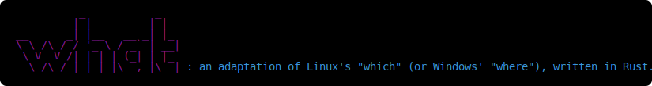
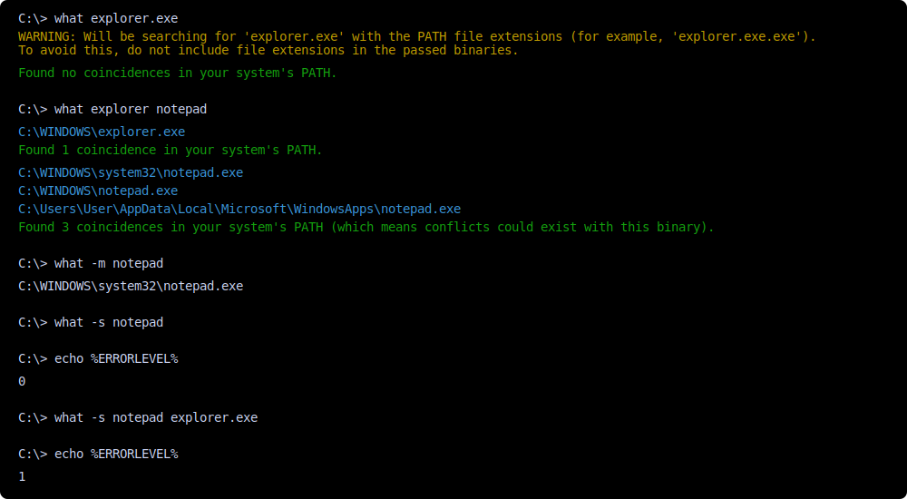
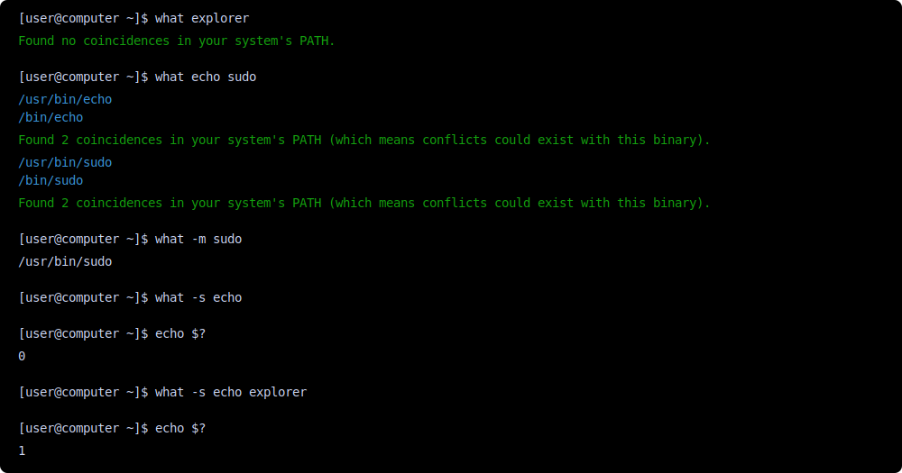

This utility searches for all of the occurrences of the passed arguments in your system's PATH (appending all of the PATH extensions if you are on Windows or checking if the found files have execution permissions in Linux).

## Usage:

```shell
what [options] <arguments>
```

### Available options:
  - _`[no options]`_ : shows all the occurrences of the passed arguments found in the system's PATH and colored messages enumerating them.
  - `-m` _(minimal)_ : shows a minimal, non-colored, _which-like_ output (only one occurrence of each argument and no extra messages).
  - `-s` _(silent)_ : runs silently and returns 0 if one occurrence of every argument is found (and 1 otherwise). Will override `-m` if both are passed.
  - `-h` or `--help` _(help)_ : shows a help menu detailing these options and the usage of the utility. Will override all other arguments passed. 

### Usage examples:
In Windows:  


In Linux:


## How to get it:
You can download the pre-compiled binary suitable for your `x86_64` system [from the Releases tab](https://github.com/Isaac-Subirana/what/releases) of this repository, and add it to your PATH (on Linux, you will need to mark it as executable). 

Alternatively, you can build it from source (you will need to have [Rust](https://rust-lang.org/tools/install/) installed), by cloning (or downloading) the contents of this repository, opening a terminal in your chosen location and then running `cargo build --release`. You will find the compiled binary in `target/release`.